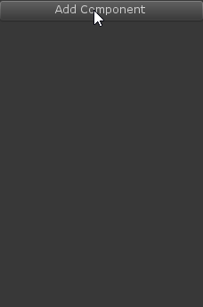
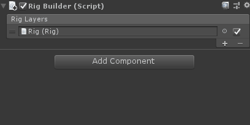
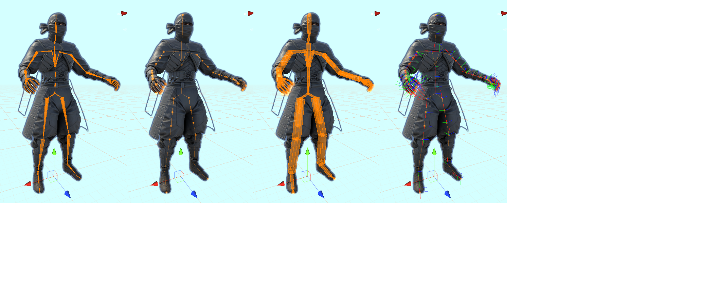
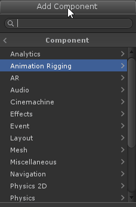
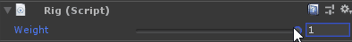
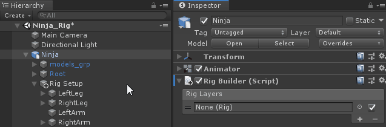
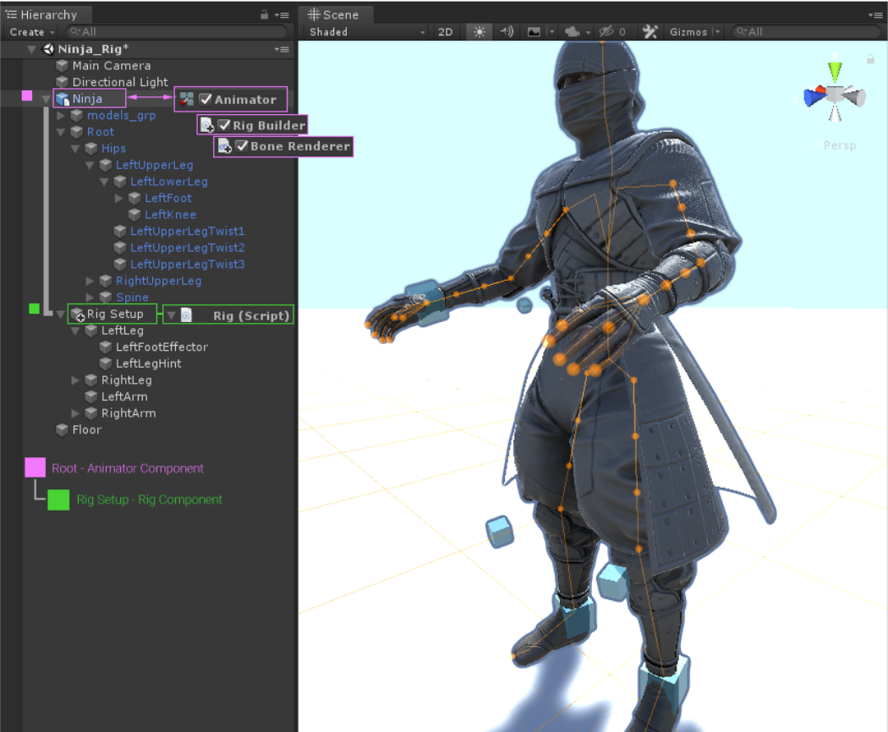
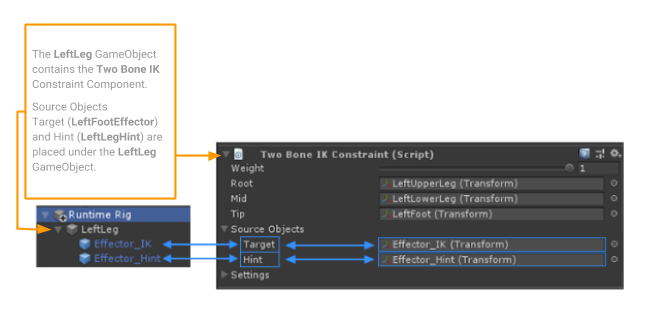

# Animation Rigging

The following document describes the setup process, constraint definitions and additional information on the Animation Rigging package **[com.unity.animation.rigging]**.

**_What is Animation Rigging ?_**

Animation Rigging allows the user to create and organize different sets of constraints based on the C# Animation Jobs API to address different requirements related to animation rigging.
This includes deform rigs (procedural secondary animation) for such things as character armor, accessories and much more.
World interaction rigs (IK, Aim, etc.) for interactive adjustments, targeting, animation compression correction, and so on.

# Workflow

The following sections present required components and steps to take in order to define an Animation Rig. This [**video**](https://youtu.be/DzW_jQGO1dc) also demonstrates package component usage to create a custom Animation Rig.

<figure class="video_container">
  <iframe width="560" height="315" src="https://www.youtube.com/embed/DzW_jQGO1dc" frameborder="0" allow="accelerometer; autoplay; encrypted-media; picture-in-picture" allowfullscreen></iframe>
</figure>

### Rig Builder Component

The Rig Builder component lives alongside the Animator component and creates a Playable Graph that is appended to the existing Animator state machine.
The Rig Builder component needs to be added to the GameObject that has the Animator component.  Rig Builder needs to affect the same hierarchy as the Animator.

Using **Rig Layers**, the Rig Builder component allows for stacking of multiple Rigs, that can be enabled/disabled at any time.

### Bone Renderer Component

The Bone Renderer component allows the user to define a transforms hierarchy to be drawn as bones for visualization and selection during the rigging process.
These bones are not visible in the Game view. This, for example, allows the user to define his character deform skeleton for rigging purposes.

The look of the bones can be customized. The Bone Size, Shape and Color can be modified.
Tripods of local axes can also be displayed and their size adjusted to accommodate user preference.
The user can choose from one of the default looks; Pyramid, Line or Box.

### Rig Effectors

Similarly to bones, Rig Effectors allow the user to add visual gizmos to transforms for visualization and selection.  These can be added to any transform
in the same hierarchy as the **Rig Builder** or **Rig** component.  Effectors are not visible in the Game view.  A special Scene View overlay has been added
to manage and customize effectors in the Rig hierarchy.

The look of the effectors can also be customized.  The Effector Size, Shape, Color, Offset Position and Offset Rotation can be modified.
The shape can be any **Mesh** asset available in the project.  Multiple effectors can be created, deleted and edited at once.

### Rig Component

The Rig component is the main entry point to all rig constraints for a given Rig. This component is assigned to a Rig Builder component under the Rig Layer field.
There should only be one Rig component per control rig hierarchy. For multiple rigs, multiple control rig hierarchies can be assigned to different Rig Layers,
and enabled/disabled independently. The main purpose of the Rig component is to collect all Constraint components defined under its local hierarchy and
generate an ordered list (evaluation order) of _IAnimationJobs_, which will then be applied after the Animator evaluation. The order in which the jobs are
evaluated is defined by component order and the way the rig hierarchy is constructed, since constraints are gathered using _GetComponentsInChildren_,
which follows depth-first traversal as shown below:

In other words, grouping constraints under a GameObject allows the user to the manage the evaluation order of these constraints
by modifying the hierarchy.

Control rig hierarchies should hold all the necessary rig elements such as effectors, constraints, and other objects/elements required by the constraint definitions.
The root of a control rig hierarchy should be at the same level as the skeleton root, both under the Game Object holding the Animator. In other words,
it should not be in the skeleton hierarchy, but rather live beside it.

Rig components, like all Constraint components, have a Weight property that can be used, animated, and scripted to enable/disable
or ease-in/ease-out an entire control rig hierarchy.

### Rig Transform

When a specific GameObject part of your rig hierarchy is important for manipulation but not referenced by any rig constraints, you'll want to add the **RigTransform** component which is found under _Animation Rigging/Setup_.
As shown in the video below, in order to manipulate both the left and right foot IK targets (_lfik_ and _rfik_) of the _2BoneIK_ sample using
their parent transform (_ik_ ), we need to add this component to get the expected behaviour.

## Defining an Animation Rig

A Rig is a hierarchy of GameObjects using a minimum of these three components; Rig Builder, Rig + Constraint(s).
A typical setup is to have a hierarchy of GameObjects [ex: Ninja.fbx] containing an Animator component on his root GameObject.
To make this hierarchy available to the Animation Rig, the **Rig Builder** component is required. Once the **Rig Builder** component is added to the root,
a _Rig GameObject [ex: Rig Setup]_ can be created as a child of this root. To enable animation rigging, the _Rig GameObject_ must
contain the **Rig** Component. Then, to connect the Rig to the Animator, the _Rig GameObject [ex: Rig Setup]_ needs to be assigned to the
_Rig Layer_ field of the *Rig Builder* component. This will associate the Animation Rig with the Animator.

The following illustration represents a schematic overview of the interdepencies between the Animator and the Animation Rig components.

Once the _Rig GameObject (ex: Rig Setup)_ holding the **Rig** component is connected to the **Rig Builder** component,  rig elements (effector GameObjects) that hold
rig Constraint components can be added under the _Rig GameObject (ex: Rig Setup)_ hierarchy. Different rig elements can be organized and hierarchically structured
to create any kind of Rig, in order to accommodate any rigging requirement.  Source GameObjects for Constraints, such as Target Effectors or Hint Effectors,
can be placed under their associated _Rig GameObject (ex: Rig Setup)_. In the following illustration, the **Left Leg** is acting as the Rig element that contains
a **Two Bone IK Constraint** component which is at the same time the parent of both **LeftFootEffector** and **LeftLegHint** source objects.  

 

# Constraint Components

The Animation Rigging package contains a few predefined constraints that you can use to define your rigs.

- [Blend Constraint](./constraints/BlendConstraint.md)
- [Chain IK Constraint](./constraints/ChainIKConstraint.md)
- [Damped Transform](./constraints/DampedTransform.md)
- [Multi-Aim Constraint](./constraints/MultiAimConstraint.md)
- [Multi-Parent Constraint](./constraints/MultiParentConstraint.md)
- [Multi-Position Constraint](./constraints/MultiPositionConstraint.md)
- [Multi-Referential Constraint](./constraints/MultiReferentialConstraint.md)
- [Multi-Rotation Constraint](./constraints/MultiRotationConstraint.md)
- [Override Transform](./constraints/OverrideTransform.md)
- [Twist Correction](./constraints/TwistCorrection.md)
- [Two Bone IK Constraint](./constraints/TwoBoneIKConstraint.md)

# Technical details

## Requirements

This version of Animation Rigging is compatible with the following versions of the Unity Editor:

* 2019.1 and later with .Net 4.x scripting runtime

## Known limitations

## Document revision history

|Date|Reason|
|---|---|
|Nov 23, 2018|First draft of package documentation|
